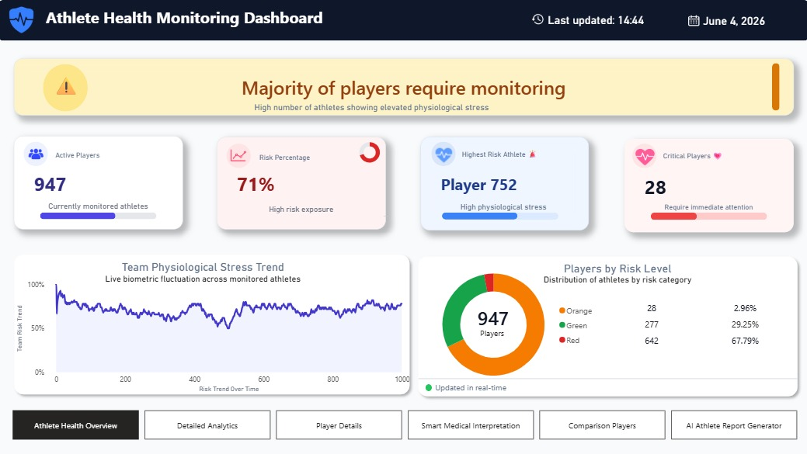
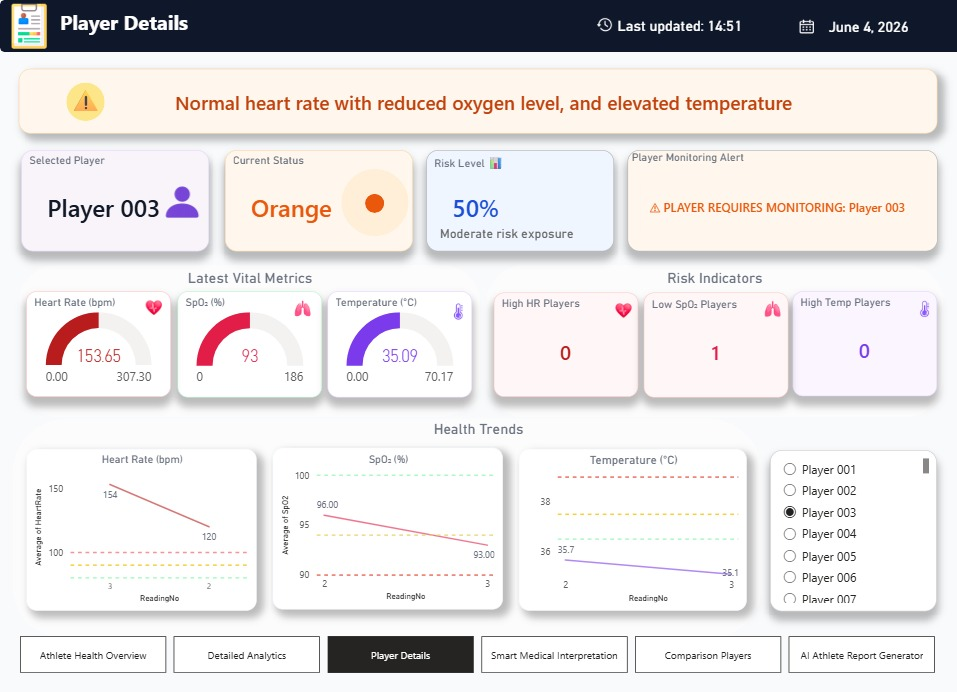
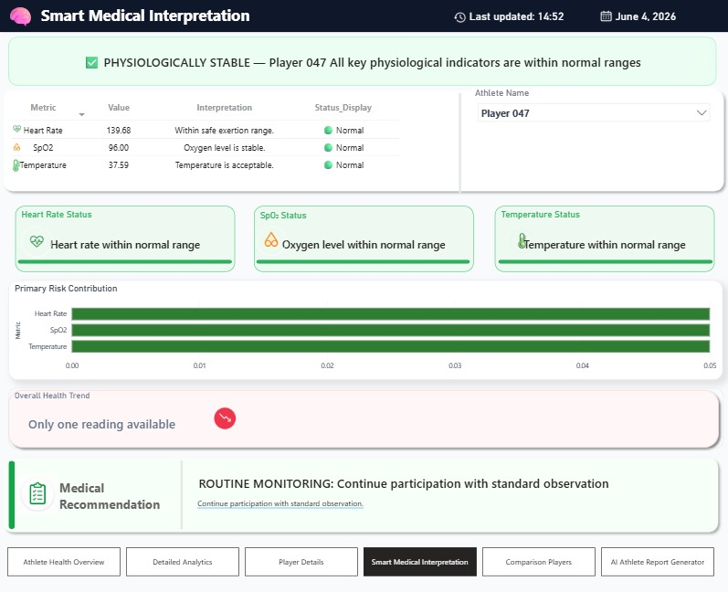
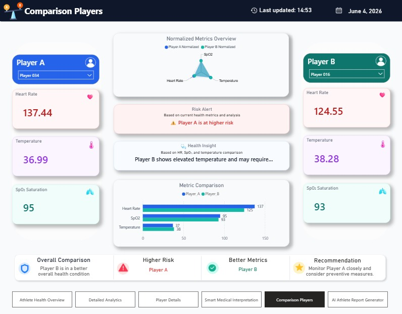
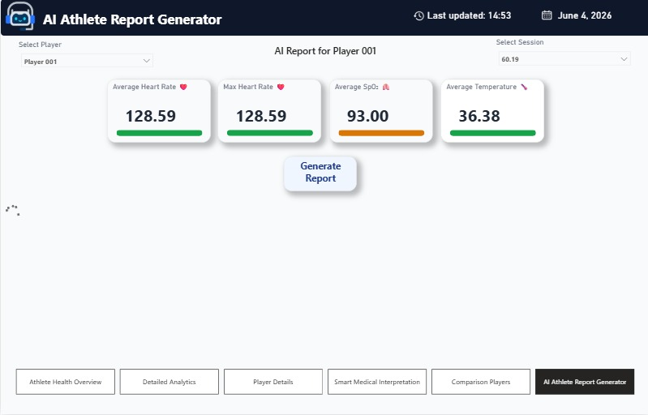
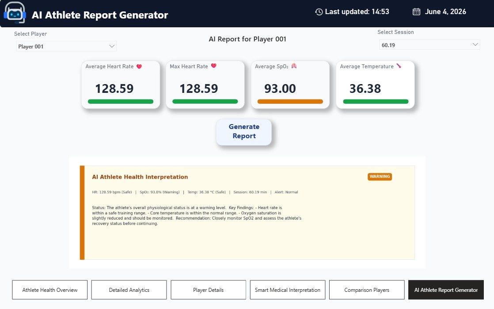

# VYTAL – AI-Powered Athlete Health Monitoring & Analytics Platform

VYTAL is an athlete health monitoring and analytics platform designed to analyze physiological data, classify health risk levels, and provide interactive visual insights with AI-assisted interpretation.

The system analyzes key physiological indicators including Heart Rate (HR), Oxygen Saturation (SpO₂), and Body Temperature.

## 🚀 Key Features

Physiological health monitoring
Evidence-based risk classification
Interactive Power BI dashboards
Data preprocessing using Power Query
Analytical calculations using DAX
Athlete comparison and risk analysis
Risk trends and health indicators
AI-assisted health interpretation using Gemini 2.5 Flash
Automated athlete health report generation

## 🛠️ Technologies

Python
Microsoft Power BI
DAX
Power Query
Pandas
NumPy
Matplotlib
Gemini 2.5 Flash
Google Generative AI API
Microsoft Excel
Git & GitHub

## 🔄 System Workflow

Athlete physiological data is provided through the project dataset.
Data is cleaned and transformed using Power Query.
Data tables and relationships are organized for analysis.
DAX measures calculate health indicators and risk metrics.
Physiological measurements are evaluated using predefined thresholds.
Results are presented through interactive Power BI dashboards.
Python and Gemini 2.5 Flash are used to generate AI-assisted health interpretations.

## 🟢🟠🔴 Health Risk Classification

VYTAL classifies athlete health status into three risk levels:

🟢 Green – Normal: Measurements are within the defined safe range.
🟠 Orange – Warning: Measurements indicate a condition requiring monitoring.
🔴 Red – Critical: Measurements indicate a critical risk condition requiring immediate attention.

The classification is based on predefined thresholds for Heart Rate, SpO₂, and Body Temperature.

## 🤖 AI Athlete Report Generator

VYTAL integrates Gemini 2.5 Flash with Power BI through a Python-based report generation workflow.

The system processes selected athlete data and generates a concise interpretation containing key findings and recommendation-oriented insights.

The generated output is intended to support athlete monitoring and does not provide medical diagnosis or replace professional medical judgment.

## 📊 Dashboard

### Athlete Health Overview

### Detailed Analytics

### Player Details

### Smart Medical Interpretation

### Comparison Players

### AI Athlete Report Generator – Before

### AI Athlete Report Generator – Generated Report

## 👩‍💻 My Contributions

Contributed to developing and refining DAX measures for health classification, risk analysis, KPIs, and dynamic dashboard outputs.
Performed data preprocessing and transformation using Power Query.
Organized the data model and established relationships between tables.
Contributed to the Python-based AI report generation workflow.
Integrated Gemini 2.5 Flash with the Power BI AI Athlete Report Generator.

## 📁 Dataset

The project uses a pre-existing athlete physiological dataset published on Kaggle.

The dataset includes physiological measurements such as Heart Rate, SpO₂, Body Temperature, and session-related data.

The dataset was cleaned and preprocessed before being used for analysis, visualization, and risk classification.

## ⚠️ Limitations

The current implementation uses a pre-existing dataset rather than real-time wearable data.
The system is designed for analytical monitoring and does not provide medical diagnosis.
AI-generated interpretations should not replace professional medical judgment.

## 🚀 Future Enhancements

Real-time integration with wearable devices.
Continuous physiological monitoring.
Predictive analytics and injury-risk forecasting.
Expanded AI-assisted health insights.
